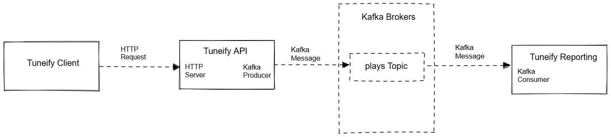
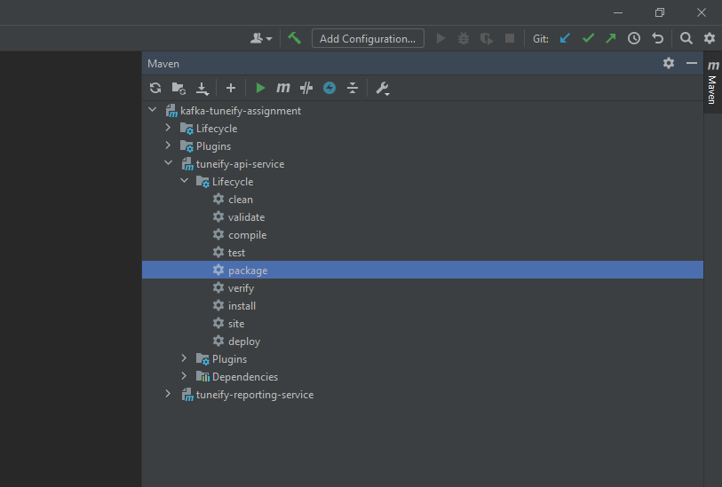
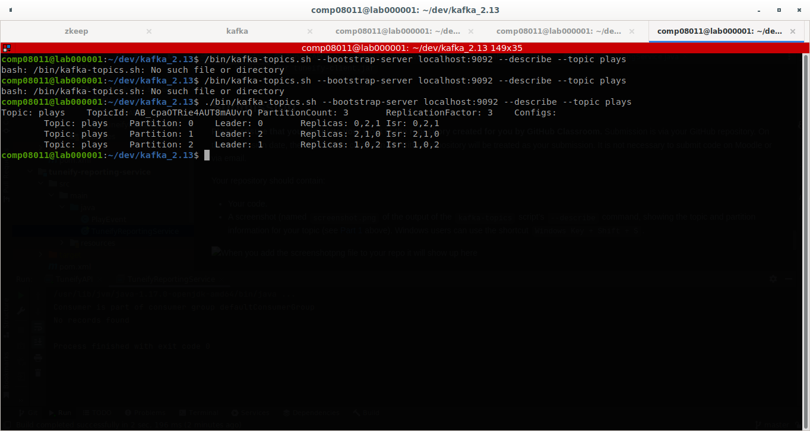

#  Kafka Assignment: Tuneify Reporting
### ATU BSc (Hons) Computing in Software Development
### Distributed Systems (COMP08011)

## Academic Integrity
<!-- ## Kafka Assignment: Tuneify -->

**This is an individual project. By accepting this assignment you agree to be bound by [ATU's Student Code of Conduct](https://www.gmit.ie/sites/default/files/public/general/docs/code-student-conduct-2019-2020.pdf), which specifically states that any work submitted under your name must be your own work and not that of any other person.**

## Introduction
In this assignment you'll build a distributed system made up of several services communicating via HTTP and Kafka. The system processes user listening data as part of an imaginary music streaming service called Tuneify. 

A common pattern in distributed systems is for a system to provide a public HTTP API which clients (e.g. mobile/desktop apps, smart TVs/speakers etc) can communicate with. Data received via this HTTP API is then published to an internal Kafka-based messaging system for processing by various other service. 

In this example Tuneify receives an event from a client device via its HTTP API every time a user plays a track. It then creates a Kafka message for this event and publishes it to a Kafka topic. This Kafka message is then consumed by a reporting service.

### Demo and Introduction Video
**A demo video introducing the starter code and demo-ing a working solution is available [here](https://web.microsoftstream.com/video/25e0d161-d898-4805-b051-764848a129e0)**

## Architecture

## Part 1 Kafka Cluster Setup
Your system should communicate using a fault-tolerant and scalable Kafka cluster set up as follows:
- 3 Kafka brokers listening on ports 9092, 9093 and 9094
- A topic called `plays` with 3 partitions and a replication factor of 3.
The system is made up of the following services:

## Part 2 - Implementation
You are provided with starter code with some parts of the functionality implemented. Your task is to complete and test the implementation of each service, as described below:

### Tuneify Client
- **you are provided with an implementation of this service as a jar file, you can run it to test your system**
- This represents user devices (mobile or desktop apps) sending information on songs being played to the Tuneify system for further processing (e.g. to generate user recommendations, artist payments etc.)
- The client sends HTTP `POST` requests to `localhost:8000/plays` with user play event data in the request body in the form of a comma-separated string as follows:
  - `userId, artistName, trackName, albumName`

### TuneifyAPI
- **you need to complete the implementation of this service**
- the Tuneify API is the entry point into the system. It has 2 parts:
  - `TuneifyAPI`: a public-facing HTTP server which handles requests send by clients to the `/plays` endpoint.
  - `TuneifyKafkaProducer`:a Kafka producer which is responsible for publishing play events to a Kafka topic.
- start in the `TuneifyAPI` class and implement a HTTP server which:
  - listens for connections on port 8000
  - handling HTTP POST requests to the `/plays` endpoint
- Initially you can print these requests to the screen to verify that it's working. You can test it by running the `TuneifyClient`:
  - `java -jar ./tuneify-client.jar`
- Once the server is working, you should then:
  - extract a string from the message body and use it to create a new instance of the `PlayEvent` class (provided).
  - `TuneifyAPI` should then use the `publishEvent` method in `TuneifyKafkaProducer` to publish a new message to a Kafka topic called `plays`
  the Kafka message should be in the following form:
    - key: userId (Long)
    - value: PlayEvent
    - timestamp: current time
- `TuneifyAPI` should print out to the screen details of each event it publishes to Kafka, including key, value, partition, offset, and topic.

### Tuneify Reporting Service
  - **you need to complete the implementation of this service**
  - `Tuneify Reporting` is a Kafka consumer which receives events from the `plays` topic and prints details of the event to the screen.

## Running the System
- You can run `TuneifyAPI` and `TuneifyReportingService` by running their main methods in the IDE if you wish. A better way to execute them is by:
  - building the jar files by using the IDE's Maven tool window to run the maven `package` goal (under Maven->{project name}->Lifecycle)

  

  - running the jar file with e.g. `java -jar ./target/tuneify-api-service-1.0-SNAPSHOT-jar-with-dependencies`
- You can test the system by sending a stream of play events from the `TuneifyClient` by running the client jar:
  - `java -jar tuneify-client.jar`

## Submission
**Please ensure that you complete your work in the repository created for you by GitHub Classroom.** Submission is via your GitHub repository. On the submission date, the most recent commit in the GitHub repository will be treated as your submission. It is not necessary to submit code on Moodle or via email.

Your repository should contain:
- Your code.
- A screenshot (named `screenshot.png` of the output of the `kafka-topics` script's `--describe` command, showing the topic and partition information for your topic (see [Part 1](#part-1-kafka-cluster-setup) above). Windows users can use the shortcut `Windows Key + Shift + S`.

## Grading
**There is no autograding for this assignment**. GitHub Actions simply builds your submission to verify that it compiles. You should avoid committing code that doesn't compile.
Your assignment will be graded by:
- running your code to verify it behaves as expected 
- verifying your Kafka topics setup by checking your submitted screenshot
- reading your code and examining your repository to assess :
    - the quality and coding style of your implementation of the functionality.
    - your adherence to coding best practices regarding formatting, variable naming etc.
    - your adherence to software development best practices in using git and GitHub.

Marks will be awarded as follows:
| Grade Item | Marks |
| --- | --- |
|tuneify-api | 50 |
| tuneify-reporting-service	| 25 |
| Kafka Topics Screenshot	| 5 |
| Quality	| 20 |
| **TOTAL** | **100** |
